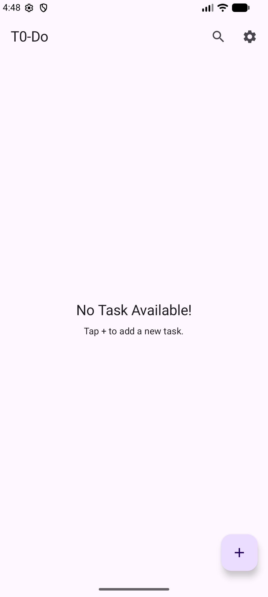
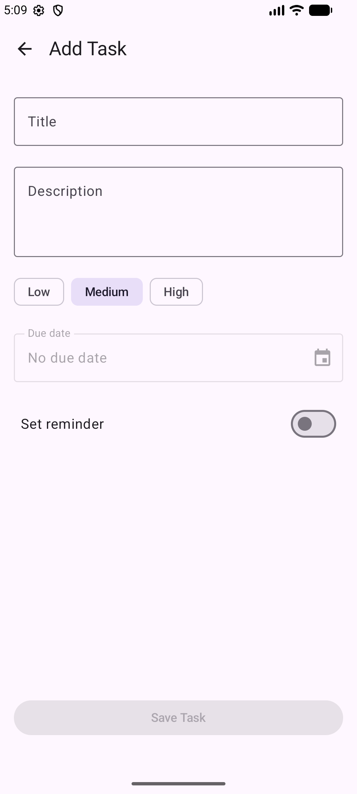
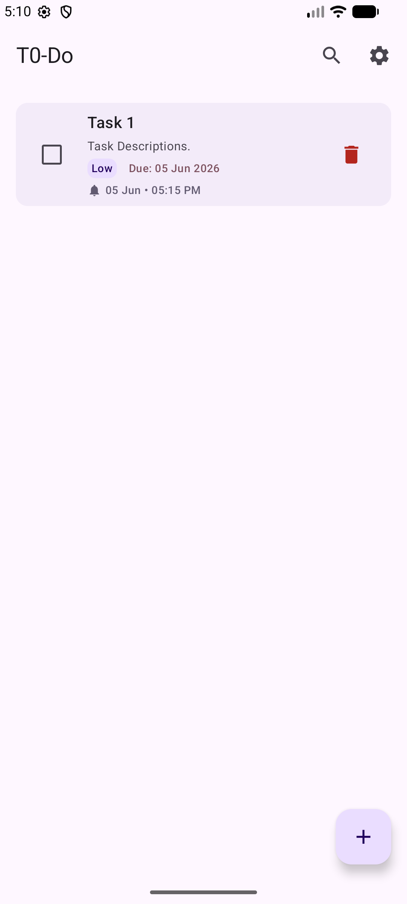
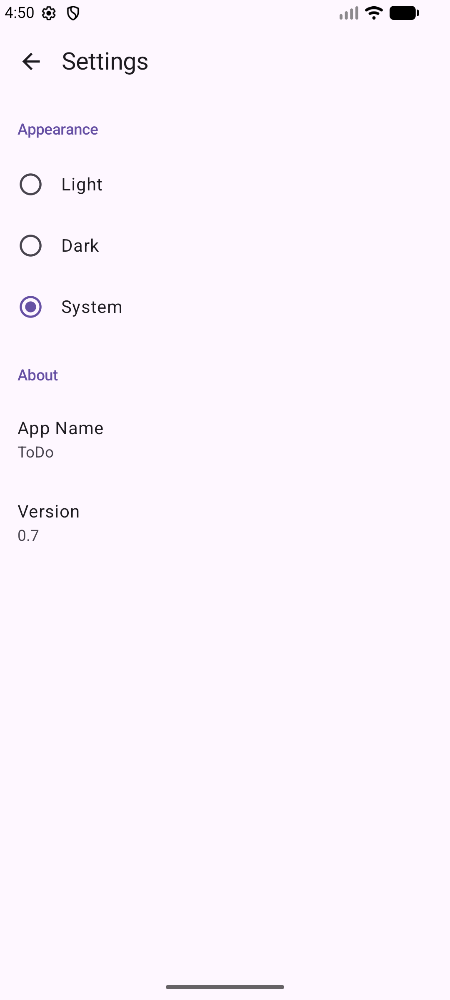
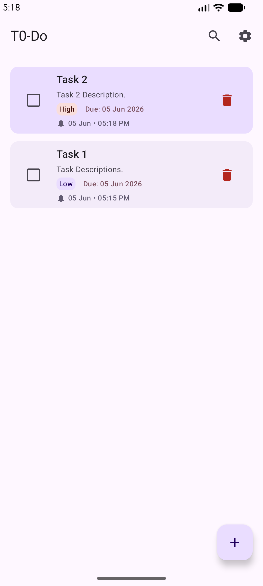

# ToDo App


A modern Android ToDo application built with Jetpack Compose and Clean Architecture. The app helps
users manage tasks efficiently with reminders, notifications, search, theme customization, and
persistent local storage.
___

## About The Project

This project was built to strengthen Android development skills using modern Android technologies and best practices. It demonstrates real-world application architecture, local persistence, background task scheduling, dependency injection, and modern UI development using Jetpack Compose.
___

## Screenshots

| Empty Task List                      | Add Task                      | Task List                 |
|--------------------------------------|-------------------------------|---------------------------|
|  |  |  |

| Settings                      | Notification                               | Highlighted Task                      |
|-------------------------------|--------------------------------------------|---------------------------------------|
|  |  |  |
___
## Installation

1. Clone the repository:
   ```bash
   git clone https://github.com/Nownitya/To-Do
   ```
2. Open the project in Android Studio (Ladybug or newer).
3. Sync the project with Gradle files.
4. Run the app on an emulator or physical device.
___

## Features

### Task Management

* Create tasks
* Edit tasks
* Delete tasks
* Mark tasks as completed
* Undo task deletion
* Search tasks

### Organization

* Priority levels (High, Medium, Low)
* Due date support
* Task completion tracking

### Reminders & Notifications

* Schedule task reminders
* WorkManager-based background scheduling
* Notification reminders
* Notification deep linking
* Automatic scroll to the relevant task
* Task highlight animation when opened from a notification

### User Experience

* Material 3 UI
* Jetpack Compose
* Light Theme
* Dark Theme
* System Theme support
* Theme persistence using DataStore
* Swipe-to-delete gesture
___
## Tech Stack

| Category             | Technology                                              |
|----------------------|---------------------------------------------------------|
| Language             | Kotlin 2.3.20                                           |
| UI                   | Jetpack Compose, Material 3                             |
| Architecture         | Clean Architecture, MVVM, Repository Pattern, Use Cases |
| Database             | Room Database                                           |
| Dependency Injection | Hilt                                                    |
| Preferences          | DataStore Preferences                                   |
| Background Tasks     | WorkManager                                             |
| Concurrency          | Kotlin Coroutines, Flow, StateFlow                      |
| Navigation           | Navigation 3                                            |
___
## Architecture

```text
presentation/
│
├── task/
├── navigation/
├── theme/
│
domain/
│
├── model/
├── repository/
├── usecase/
│
data/
│
├── local/
├── repository/
├── reminder/
└── preferences/
```
___

## Project Highlights

* Clean Architecture implementation
* Dependency Injection using Hilt
* Offline-first local storage
* Reminder scheduling with WorkManager
* Notification navigation and task highlighting
* Persistent theme preferences using DataStore
* Modern Android development using Jetpack Compose
___

## Version History

### v0.8

* Notification navigation
* Auto-scroll to reminder task
* Task highlight animation

### v0.7

* Settings screen
* Theme persistence
* System/Light/Dark mode support

### v0.6

* Hilt Dependency Injection

### v0.5

* Search optimization and code improvements

### v0.4

* WorkManager integration

### v0.3

* Due dates and reminders

### v0.2

* Clean Architecture refactor

### v0.1

* Basic CRUD functionality
___

## Future Improvements

* Statistics dashboard
* Data export/import
* Backup & restore
* Home screen widgets
* Multi-module architecture
* Cloud synchronization
___

## Author

**Nownitya Sharma**

Android Developer

- Kotlin
- Jetpack Compose
- Clean Architecture
- Android Development
___

## License

```text
Copyright 2026 Nownitya Sharma
Licensed under the Apache License, Version 2.0
```
